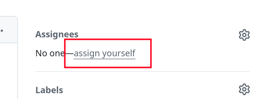

# Assignment 1: Writing an AST-based detector

The goal of the first assignment is to write a simple AST-based detector for [Misti](https://github.com/nowarp/misti) to set up the environment and become familiar with the detectors' API.

## Context

[Misti](https://nowarp.io/tools/misti) is a static analyzer for the [Tact](https://tact-lang.org) smart-contract language. Some details about it:

- It has a small source code base written in TypeScript.
- It targets a statically-typed language used in production.
- It is well-documented; the [documentation](https://nowarp.io/tools/misti/docs/next/) and the [API reference](https://nowarp.io/tools/misti/api/) are available.
- It provides an API to write custom detectors to implement AST-based, dataflow, and Datalog-based analyses.

All of this enables us to practice writing simple analyses on a small yet real-world project.

## Assignment steps

1. Choose [one of the issues labeled `assignment-1`](https://github.com/Static-Homeworks-CUB/fall2024/issues?q=label%3A%22assignment-1%22) or suggest your own detector:

Suggesting your own detector

You could [suggest your own AST-based detector](https://github.com/nowarp/misti/issues/new?assignees=&labels=triage&projects=&template=assignment-1-suggestion.md&title=). The detectors used in the first assignment should be simple and use the AST representation of the program. They don't have to address real-world problems, but any ideas are welcome. You can get inspiration for such detectors by reading different coding standards and the documentation of other static analyzers:

- MISRA C/C++ and AUTOSAR C++ rules: coding standards used in development of embedded safety-critical systems
- Slither detector documentation: https://github.com/crytic/slither/wiki/Detector-Documentation
- SmartCheck rules: https://github.com/smartdec/smartcheck
If you have any idea, please [create an issue](https://github.com/nowarp/misti/issues/new?assignees=&labels=triage&projects=&template=assignment-1-suggestion.md&title=), and we will approve it ASAP.

2. Assign yourself to the chosen issue in the GitHub interface: 
3. Examine the source code in this directory. You could take a look at [the `SingleLetterIdentifier` detector](./single-letter-identifier) here as an example.
4. Create your own detector following the same code structure as the existing ones.
5. Write unit tests to show that your implementation works correctly. Use `*.spec.ts` files in this directory as an example.
6. Ensure the ESLint linter and the Prettier formatter don't report on your code and your detector passing tests: `yarn test-all`
7. Commit and push changes to your fork. Create a pull request to the main repo: https://github.com/Static-Homeworks-CUB/fall2024/pulls

## Resources

1. https://nowarp.io/tools/misti/docs/next/ – Misti Documentation
2. https://nowarp.io/tools/misti/api/ – Misti API reference
